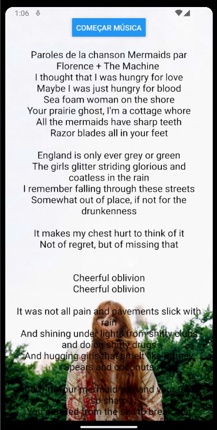
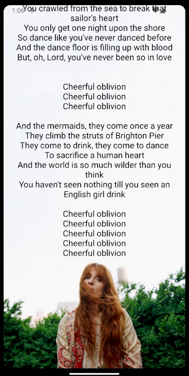

# appLetraMusica
Atividade para treinar uso de API.

  <h3>Escolhi uma que busca uma letra de música e mostra na tela</h3>
   

  https://github.com/parrylt/appLetraMusica/assets/132522416/f9f20f83-41ec-4c1f-aeb2-21ee7e5ae7b0

